# Лабораторная работа № 4 по &laquo;Тестированию программного обеспечения&raquo;

Студент: Суркис Антон Игоревич

Группа: P33113

Преподаватель: Грудина Анна Михайловна

## Задание

С помощью программного пакета Apache JMeter провести нагрузочное и стресс-тестирование веб-приложения в соответствии с вариантом задания.

В ходе нагрузочного тестирования необходимо протестировать 3 конфигурации аппаратного обеспечения и выбрать среди них наиболее дешёвую, удовлетворяющую требованиям по максимальному времени отклика приложения при заданной нагрузке (в соответствии с вариантом).

В ходе стресс-тестирования необходимо определить, при какой нагрузке выбранная на предыдущем шаге конфигурация перестаёт удовлетворять требованиями по максимальному времени отклика. Для этого необходимо построить график зависимости времени отклика приложения от нагрузки.
- Приложение для тестирования доступно только во внутренней сети кафедры.
- Если запрос содержит некорректные параметры, сервер возвращает HTTP 403.
- Если приложение не справляется с нагрузкой, сервер возвращает HTTP 503.

Параметры тестируемого веб-приложения:
- URL первой  конфигурации ($ 2800) - http://aqua:8080?token=466636729&user=1964540572&conf=1;
- URL второй  конфигурации ($ 4400) - http://aqua:8080?token=466636729&user=1964540572&conf=2;
- URL третьей конфигурации ($ 7200) - http://aqua:8080?token=466636729&user=1964540572&conf=3;
- Максимальное количество параллельных пользователей - 9;
- Средняя нагрузка, формируемая одним пользователем - 40 запр. в мин.;
- Максимально допустимое время обработки запроса - 570 мс.

Отчёт по работе должен содержать:
- Текст задания.
- Описание конфигурации JMeter для нагрузочного тестирования.
- Графики пропускной способности приложения, полученные в ходе нагрузочного тестирования.
- Выводы по выбранной конфигурации аппаратного обеспечения.
- Описание конфигурации JMeter для стресс-тестирования.
- График изменения времени отклика от нагрузки для выбранной конфигурации, полученный в ходе стресс-тестирования системы.
- Выводы по работе.

## Решение

Конфигурация JMeter:
- Пул потоков
    - Постоянный таймер на 1500 мс
    - HTTP Sampler

При стресс-тесте &mdash; ручное определение количества потоков, при котором сайт будет возвращать 503 через некоторое время (10 секунд было достаточно).

При нагрузочном тестировании &mdash; добавление 1 потока раз в 3 секунды, завершение теста при превышении требуемого времени ответа.

### Конфигурация 1 ($2800):
- Падает при 97 пользователях;
- При 96 пользователях возвращает ответ:
    ```
                  load:  48,10 r/s
         response time:   2936 ms
     max response time:    990 ms
    ```
- Перестает отвечать требованиям по задержке при 22 пользователях.

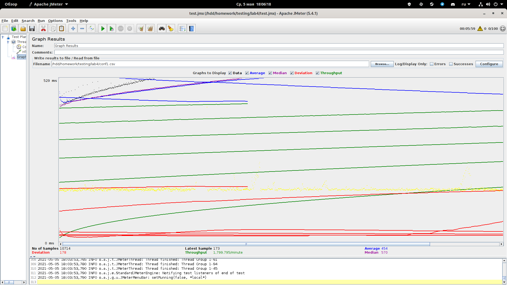
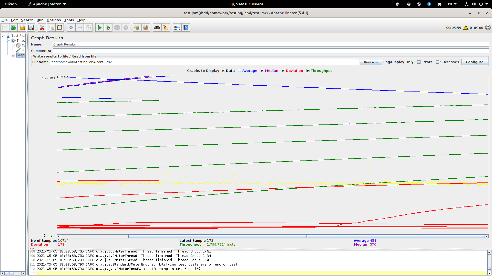
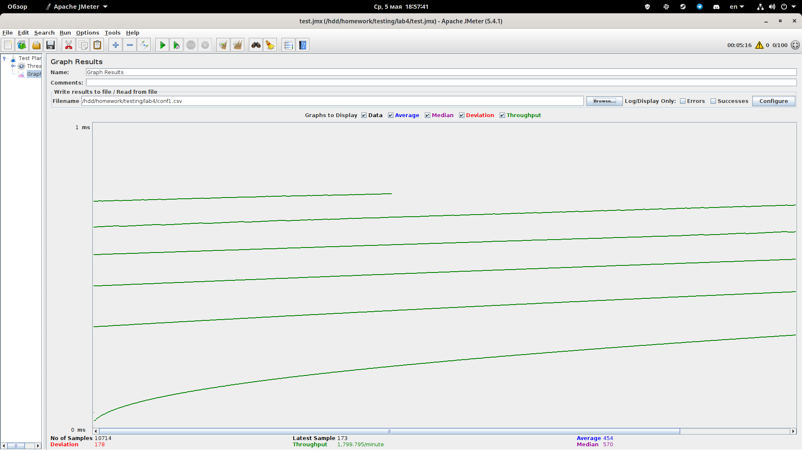


### Конфигурация 2 ($4400):
- Падает при 98 пользователях;
- При 97 пользователях возвращает ответ:
    ```
                  load:  47,60 r/s
         response time:   2748 ms
     max response time:    990 ms
    ```
- Перестает отвечать требованияимя по задержке при 34 пользователях.

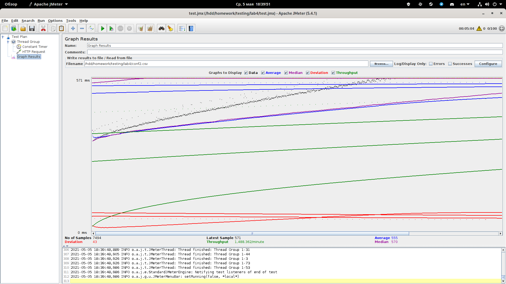
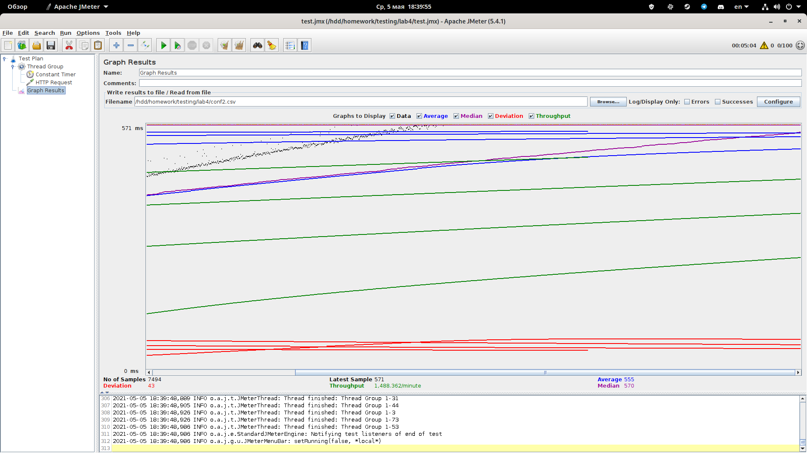
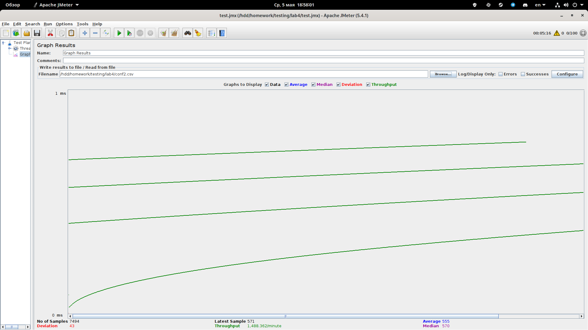
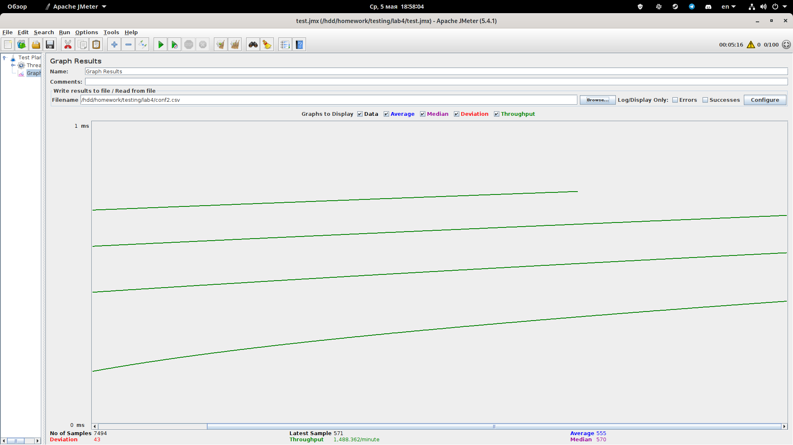

### Конфигурация 3 ($7200):
- Падает при 99 пользователях;
- При 98 пользователях возвращает ответ:
    ```
                  load:  47,30 r/s
         response time:   2796 ms
     max response time:    990 ms
    ```
- Перестает отвечать требованияимя по задержке при 44 пользователях.

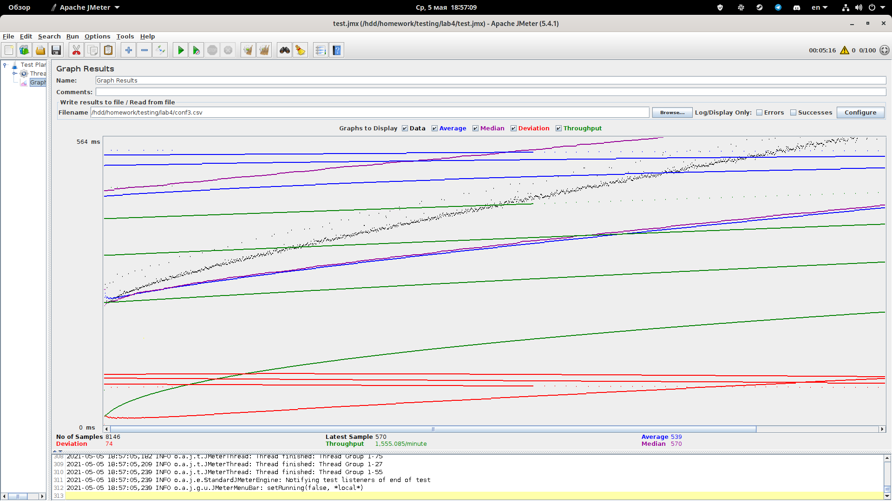
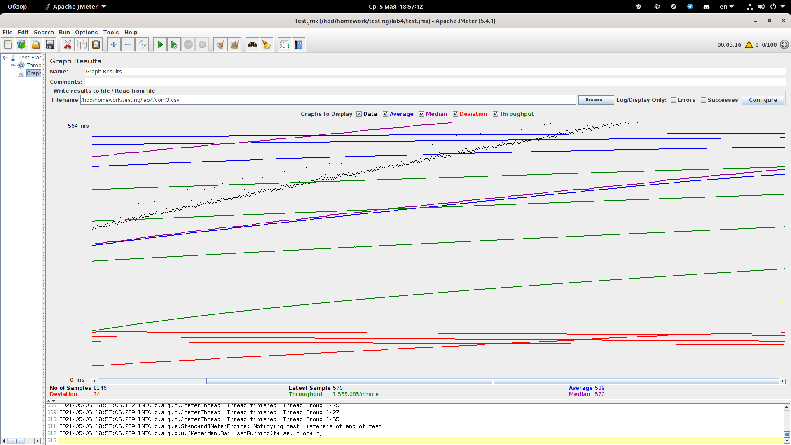
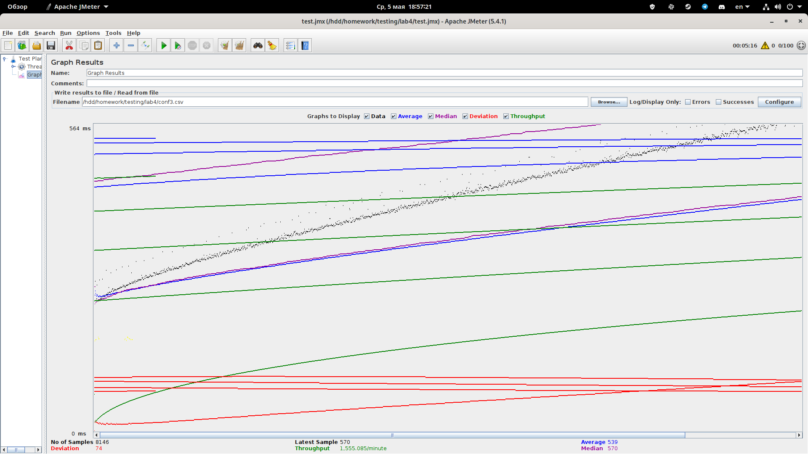
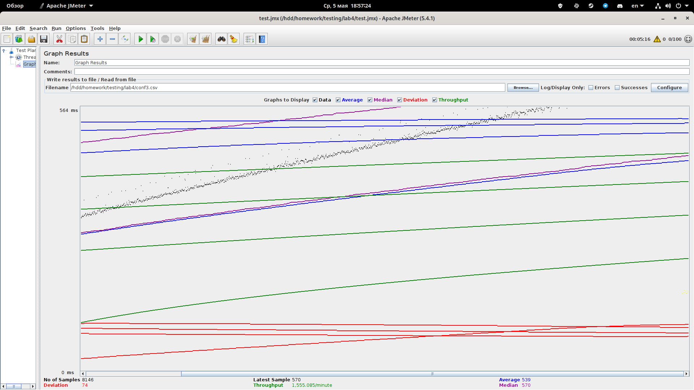

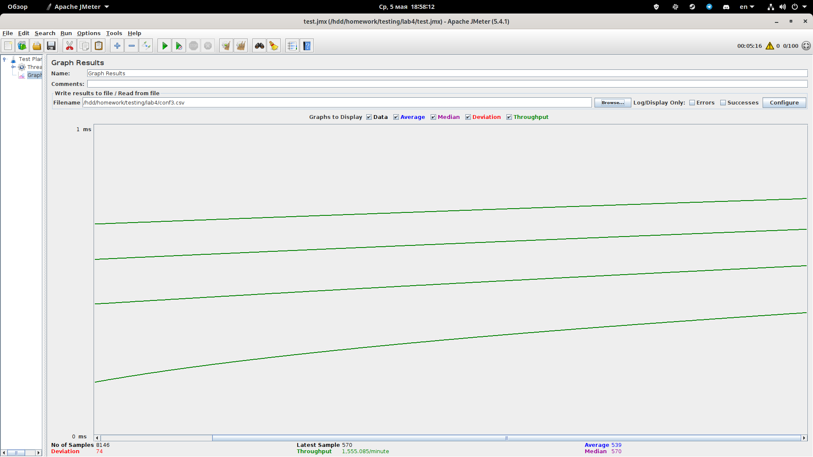
